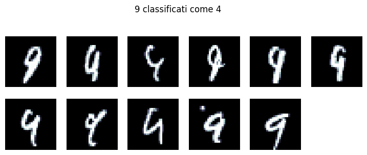
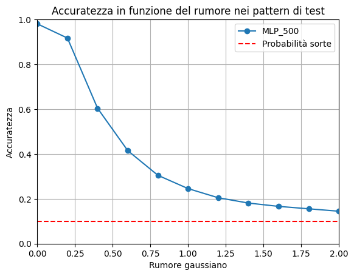
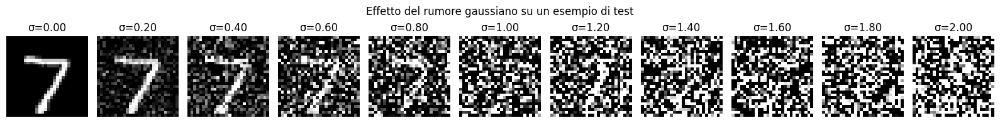
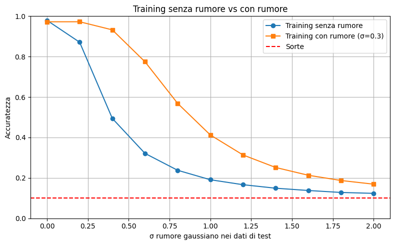
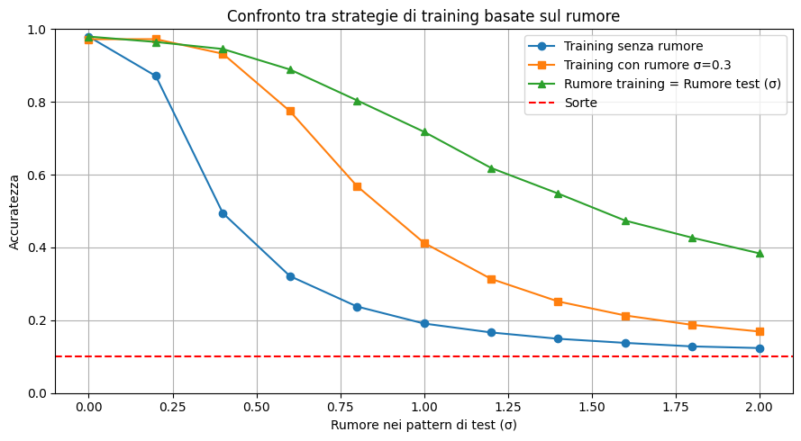

# Studio sul rumore su MNIST
   

In questo progetto, analizziamo l'effetto del rumore sulle immagini del dataset MNIST. L'obiettivo è comprendere come il rumore influisce sulle prestazioni dei modelli di classificazione delle cifre scritte a mano.

## Introduzione
Il dataset MNIST è un insieme di immagini di cifre scritte a mano, ampiamente utilizzato per addestrare e testare algoritmi di riconoscimento delle immagini. Tuttavia, le immagini possono essere soggette a rumore, che può degradare le prestazioni dei modelli di classificazione. In questo studio, aggiungeremo diversi tipi di rumore alle immagini MNIST, sia nel training che nel test, e valuteremo l'impatto sulle prestazioni dei modelli.

Il rumore utilizzato in questo studio si tratta di rumore gaussiano, che viene aggiunto alle immagini per simulare condizioni di acquisizione non ideali.

## 1. Errori di classificazione senza rumore
### Modello
Il modello su cui viene svolto il test è una semplice rete neurale di tipo MLP (Multi-Layer Perceptron) con due layer nascosti da 500 neuroni. La rete è addestrata sul dataset MNIST senza rumore e testata su immagini anch'esse prive di rumore.
### Risultati
I risultati mostrano che il modello addestrato su immagini senza rumore riesce a classificare correttamente le immagini di test senza rumore, raggiungendo un'accuratezza elevata. Tuttavia, talvolta il modello commette errori di classificazione, specialmente su immagini che presentano caratteristiche simili tra le classi. In seguito vengono illustrati alcuni esempi di classificazione errata.

## 2. Accuratezza del modello in base al rumore nei pattern di test
### Modello
Qui viene utilizzato lo stesso modello MLP con due layer nascosti da 500 neuroni, addestrato sul dataset MNIST senza rumore. Tuttavia, le immagini di test vengono modificate aggiungendo rumore gaussiano con varianza crescente.

### Risultati
I risultati mostrano che l'accuratezza del modello diminuisce all'aumentare del livello di rumore nelle immagini di test. In particolare, si osserva una significativa riduzione delle prestazioni quando il rumore supera una certa soglia, indicando che il modello non è robusto a condizioni di rumore elevate.

Mostriamo a cosa corrisponde visivamente la quantità di rumore aggiunta alle immagini di test. Le immagini con rumore più elevato appaiono più sfocate e meno riconoscibili, il che spiega la diminuzione dell'accuratezza del modello.

Osserviamo che il modello addestrato su immagini senza rumore non riesce a generalizzare bene su immagini rumorose, portando a una riduzione significativa dell'accuratezza, restando tuttavia migliore alla probabilità di classificazione casuale (10% per 10 classi).

## 3. Confronto dell'accuratezza del modello in base alla presenza di rumore nei pattern di training
### Modello
In questa sezione, sono state addestrate due versioni del modello MLP con due layer nascosti da 300 neuroni: una sul dataset MNIST senza rumore e l'altra su immagini con rumore gaussiano con varianza pari a 0.3. Entrambi i modelli sono stati testati su immagini di test con diversi livelli di rumore.

### Risultati
I risultati mostrano che il modello addestrato su immagini con rumore è più robusto e mantiene un'accuratezza più elevata rispetto al modello addestrato su immagini senza rumore, specialmente quando le immagini di test presentano livelli di rumore simili a quelli presenti durante l'addestramento. Questo indica che l'addestramento con immagini rumorose può migliorare la capacità del modello di generalizzare su dati rumorosi.

## 4. Confronto dell'accuratezza del modello in base alla quantità di rumore nei pattern di training
### Modello
In questa sezione, sono state utilizzate le due versioni dello studio precedente. Inoltre, sono state addestrate in aggiunta diverse versioni del modello MLP con due layer nascosti da 300 neuroni, utilizzando immagini di training con rumore gaussiano di varianza crescente (con incrementi di 0.2). Tali modelli sono stati testati su immagini di test con rumore pari alla stessa varianza di rumore delle immagini di training.

### Risultati
I risultati mostrano una maggiore robustezza dei modelli con la stessa quantità di rumore nei pattern di training e test. In particolare, i modelli addestrati con immagini di training molto rumorose tendono a mantenere un'accuratezza relativamente elevata rispetto ai modelli addestrati con immagini di training meno rumorose.

Ciò che sorprende di più è l'osservare come la varianza pari a 2.0 nei pattern (vedi esempio sopra), che corrisponde a un livello di rumore molto elevato, sia quasi incomprensibile per l'occhio umano, ma il modello addestrato con la stessa quantità di rumore riesce comunque a classificare correttamente le immagini di test con un'accuratezza quasi del 40%. Questo dimostra le potenzialità dei modelli di apprendimento automatico nell'adattarsi a condizioni di rumore estreme, anche quando le immagini risultano difficili da interpretare per gli esseri umani.

# Esecuzione
## Requisiti
- Python 3.10.19 (o altra versione compatibile)
- pip
- venv o conda per la gestione degli ambienti virtuali (ozpionale ma consigliato)

Aprire il file ipynb ed eseguire il codice dopo aver installato le dipendenze necessarie.
È consigliato creare un ambiente virtuale con Python 3.10.19 e installare le dipendenze elencate nel file requirements.txt.
